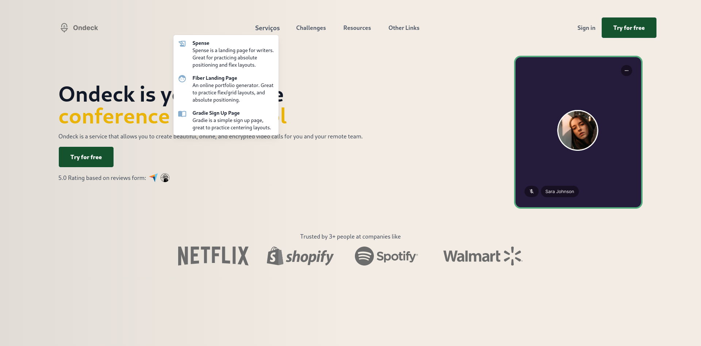

# Navbar responsivo com ReactJS + TailwindCSS

<h1 align="center">
  
</h1>

## Tecnologias

Esse projeto foi desenvolvido com as seguintes tecnologias:

- [React](https://reactjs.org)
- [TypeScript](https://www.typescriptlang.org/)
- [TailwindCSS](https://tailwindcss.com/)

## Github pages

Acesse diretamente pelo Github Pages em: https://rafatosta.github.io/responsive-navbar/

## Projeto

Desafio [Javascript30 Navbar](https://www.codewell.cc/challenges/javascript30-navbar--623f19001fa95910c7bf998e) do [CodeWell](https://www.codewell.cc/).

